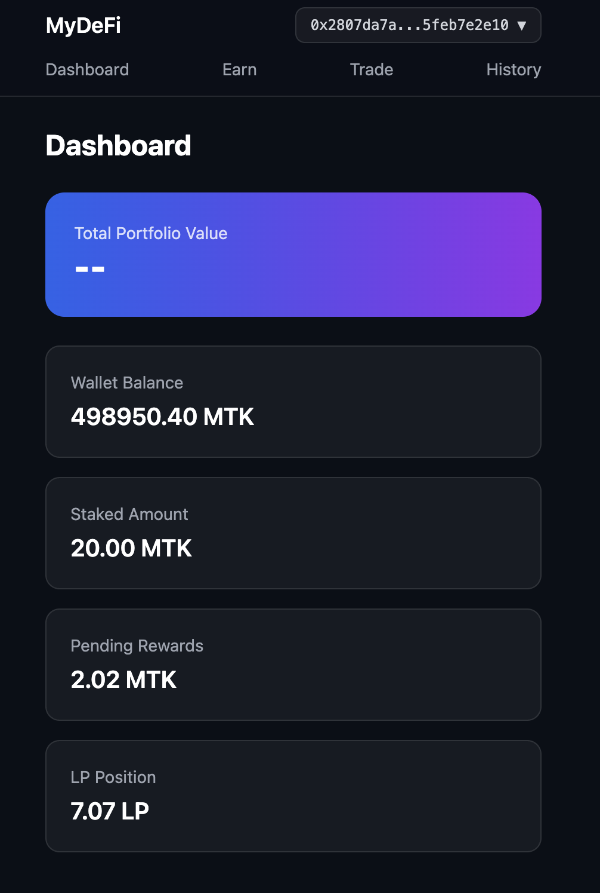
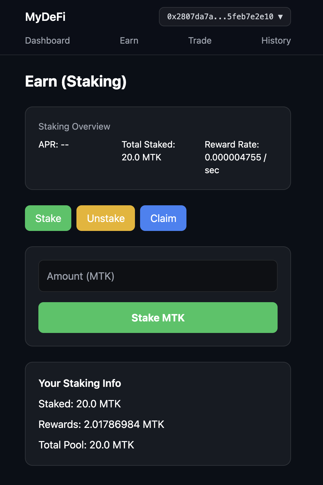
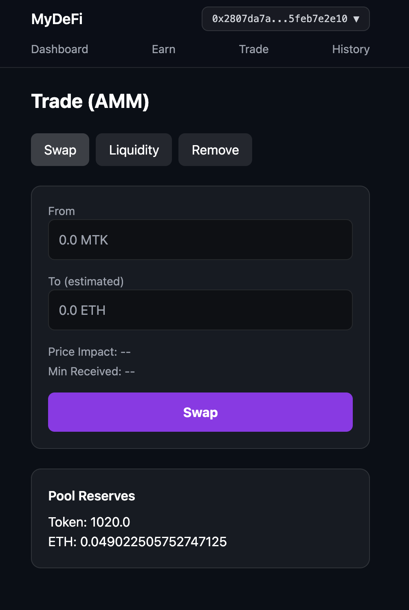
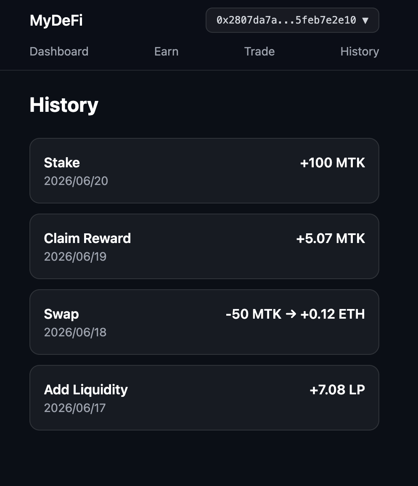

# Mini DeFi Platform

A full-stack Web3 application that demonstrates a unified DeFi experience through asset management, staking, trading, and liquidity provision.

Built with **Solidity, Hardhat, React, Vite, Tailwind CSS, and Ethers.js**, the application integrates multiple smart contracts into a unified product-oriented interface running on the Sepolia testnet.

# Screenshots

## Dashboard

## Earn

## Trade

## History

# Concept

Rather than presenting independent smart contract examples, this project is designed as a mini DeFi platform where users can:

- Hold digital assets
- Earn staking rewards
- Trade through an AMM
- Provide liquidity
- Monitor portfolio status

The goal is to recreate the core workflow of a decentralized finance application within a unified user experience.

# Features

## Dashboard

The Dashboard serves as the central overview of the user's portfolio.

It displays:

- Wallet MTK balance
- Staked MTK amount
- Pending staking rewards
- LP token position
- On-chain asset summary

Changes made in other sections are reflected here in real time.

## Earn

The Earn section allows users to generate yield from idle assets.

Features include:

- Stake MTK
- Withdraw staked MTK
- Claim accumulated rewards
- Real-time reward calculation
- APY-based staking model

This demonstrates time-based reward accounting implemented entirely on-chain.

## Trade

The Trade page implements a simplified decentralized exchange using an Automated Market Maker.

Current functionality includes:

- MTK ↔ ETH swaps
- Liquidity provision
- Liquidity removal
- LP token minting and burning
- Pool reserve visualization
- Estimated output preview

The pricing mechanism follows the constant product formula (x × y = k).

## History

The History page provides a dedicated interface for transaction tracking.

# Smart Contracts

## MyToken (ERC-20)

- OpenZeppelin ERC-20 implementation
- Transfer
- Approve
- TransferFrom

## Staking

- Deposit
- Withdraw
- Claim rewards
- Time-based reward distribution
- rewardPerToken accounting model

## Automated Market Maker

- Token ↔ ETH swaps
- Liquidity provision
- Liquidity removal
- LP token issuance
- Constant product pricing model

# Tech Stack

## Blockchain

- Solidity
- Hardhat
- OpenZeppelin

## Frontend

- React
- Vite
- Tailwind CSS
- Ethers.js
- MetaMask

## Network

- Sepolia Testnet

# Future Improvements

- Event-based transaction history
- USD portfolio valuation
- Configurable slippage tolerance